<p align="center">
  
</p>

<h1 align="center">Xime（曦码） - 五笔/拼音输入法</h1>

<p align="center">
  <a href="README.md">English</a> · <a href="README.zh-TW.md">繁體中文</a>
</p>

[](https://f-droid.org/packages/com.kingzcheung.xime)


[Xime 输入法 (Windows 版)](https://github.com/ximeiorg/XimeYao) | [Xime 输入法 (Linux 版)](https://github.com/ximeiorg/XimeChe) | [联想词预测模型](https://github.com/ximeiorg/predictive-text) | [手写输入法模型](https://github.com/ximeiorg/ochwpro)

一款基于 <a href="https://rime.im/">Rime</a> 引擎构建的 Android 五笔/拼音输入法，专注于简洁高效的中文输入体验。

如果你觉得 UI 或者功能不符合你的要求，你可以直接 fork 一份自行修改。

---

> 本输入法支持五笔/拼音输入，只是本人以五笔为主，拼音为辅，因此资源会倾向于五笔为主。
如果你是拼音用户，默认的拼音不是很强大，你可以到扩展市场里下载如`凇雾拼音` 之类的方案。

<table align="center">
  <tr>
    <td>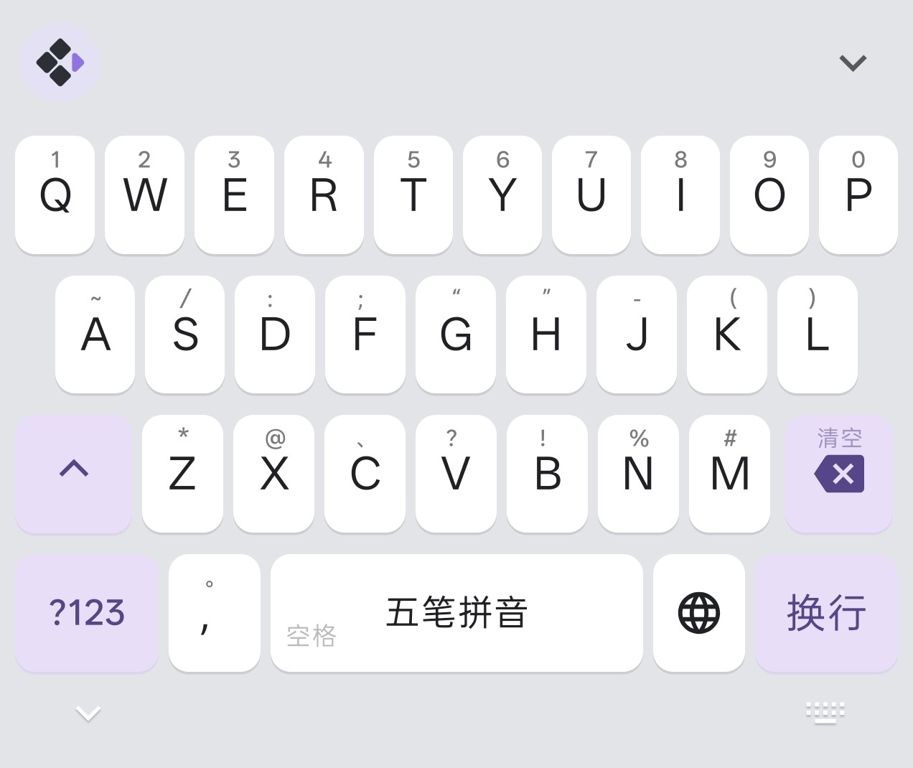<br><p align="center">全键盘（亮色）</p></td>
    <td>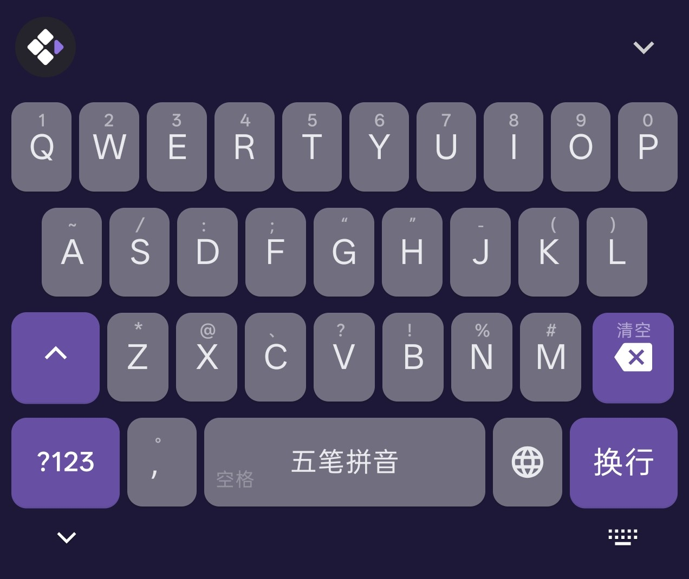<br><p align="center">全键盘（暗色）</p></td>
    <td><br><p align="center">字根下滑</p></td>
    <td>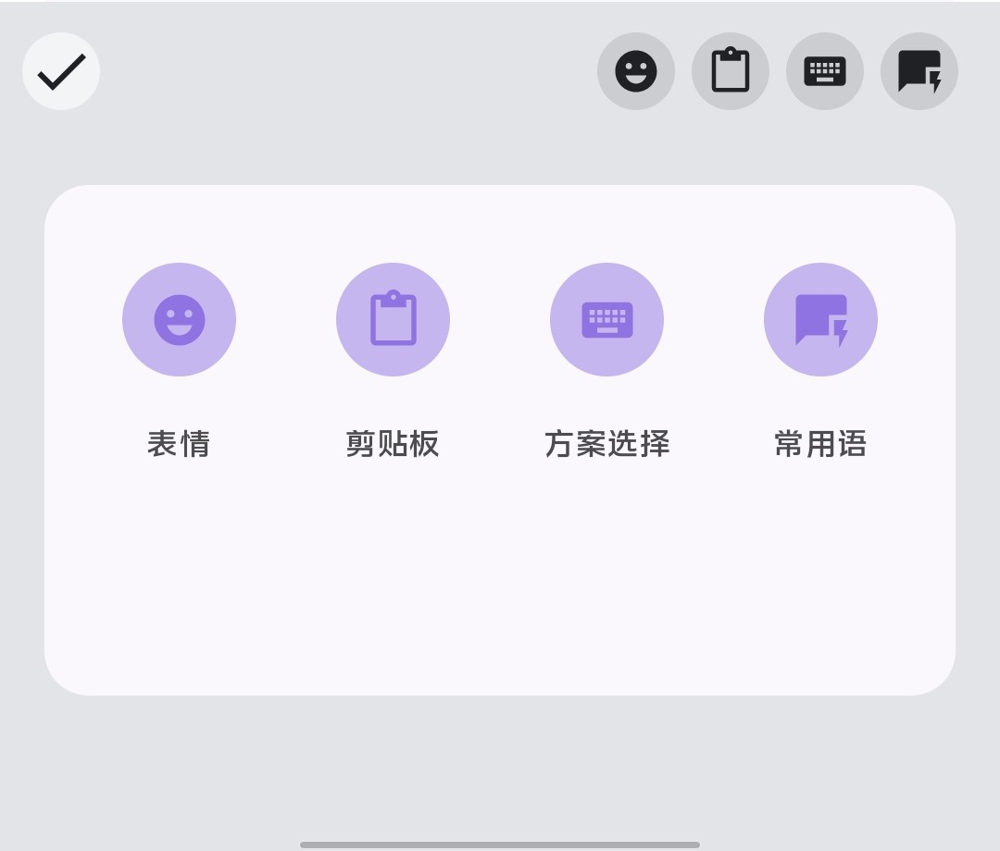<br><p align="center">快捷操作</p></td>
  </tr>
  <tr>
    <td>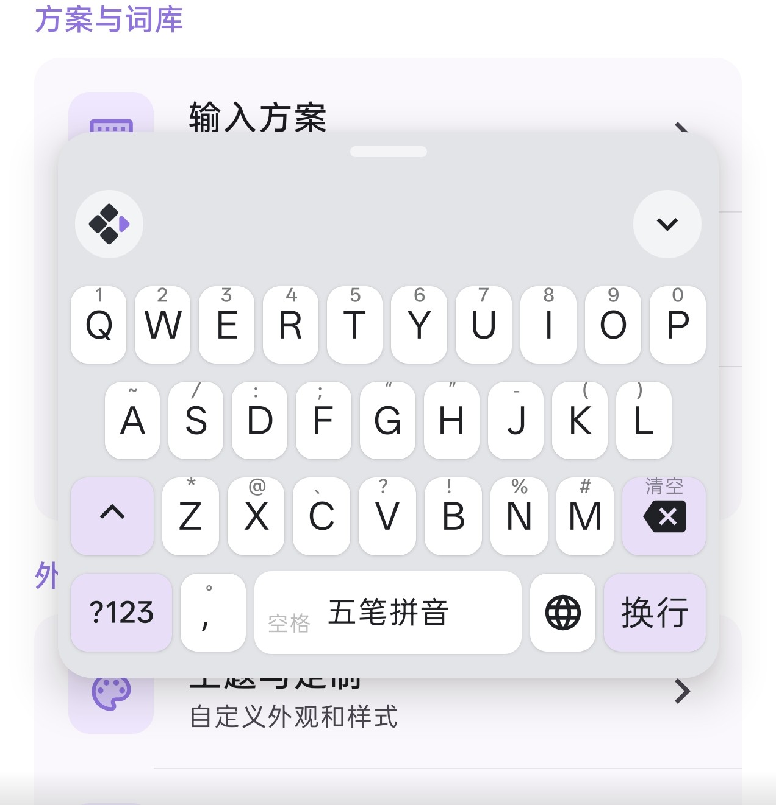<br><p align="center">悬浮键盘</p></td>
    <td>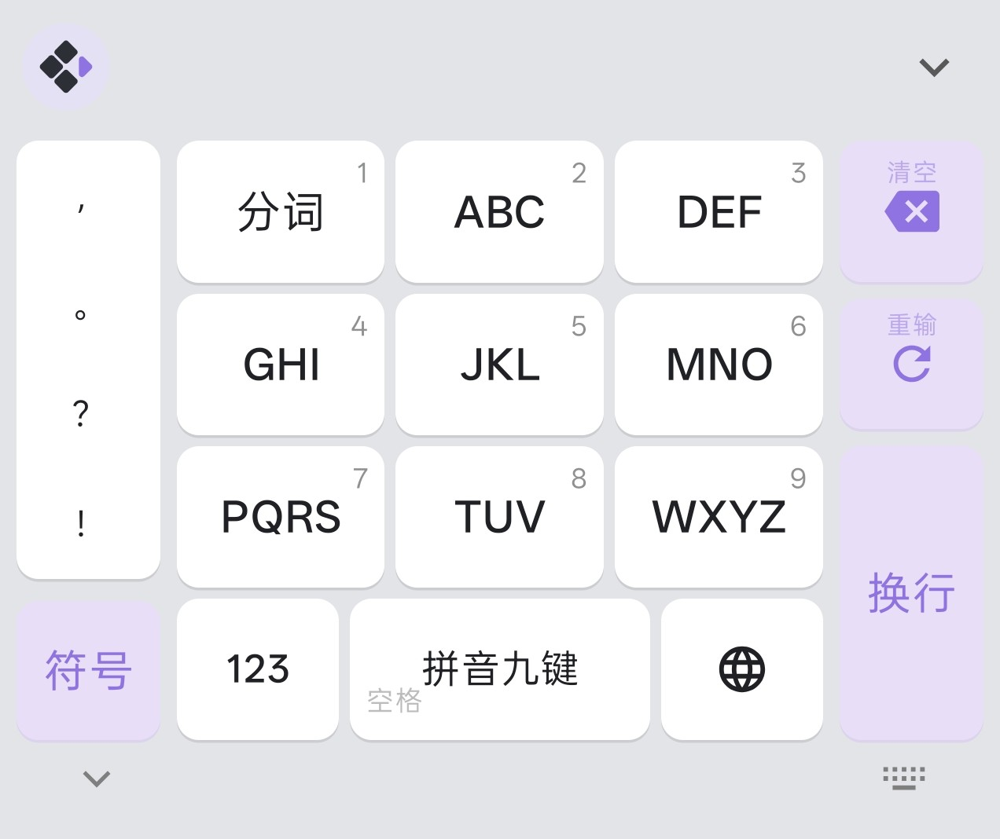<br><p align="center">T9 九宫格拼音</p></td>
    <td>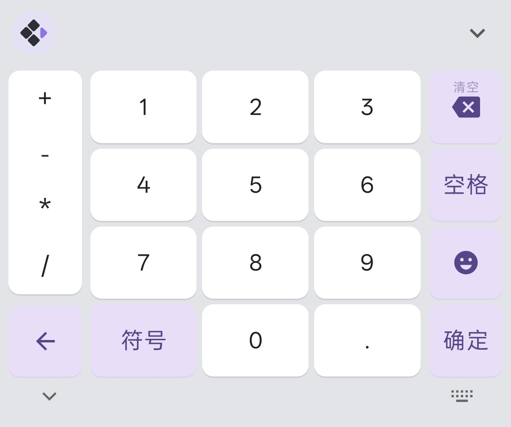<br><p align="center">数字键盘</p></td>
    <td>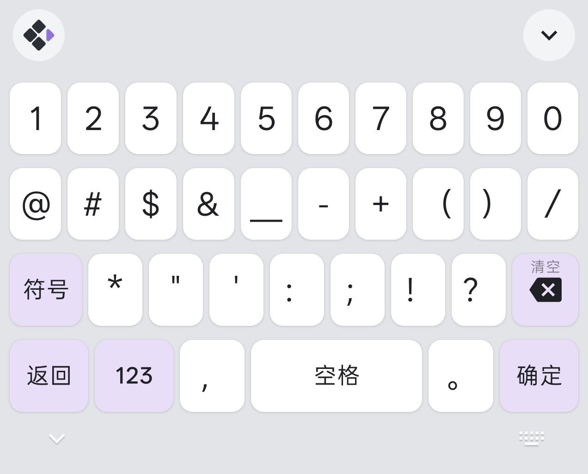<br><p align="center">符号键盘</p></td>
  </tr>
  <tr>
    <td>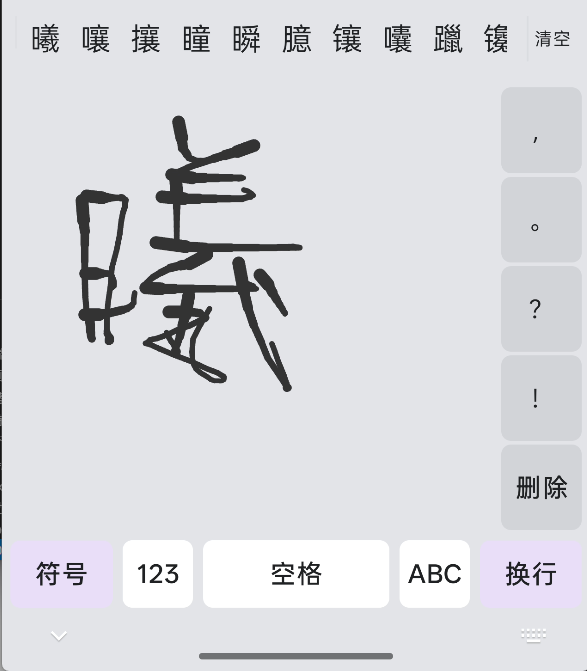<br><p align="center">手写输入</p></td>
    <td>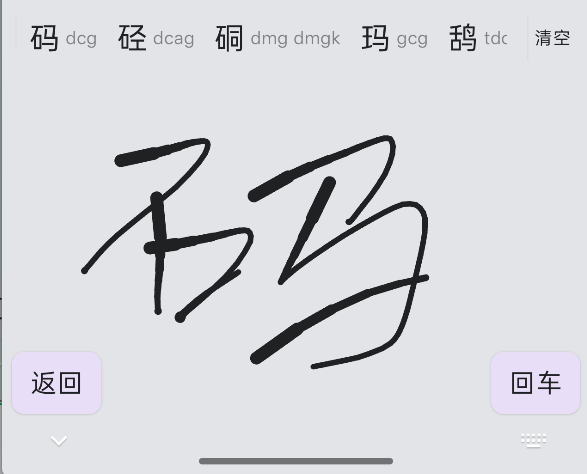<br><p align="center">手写找字（候选）</p></td>
    <td>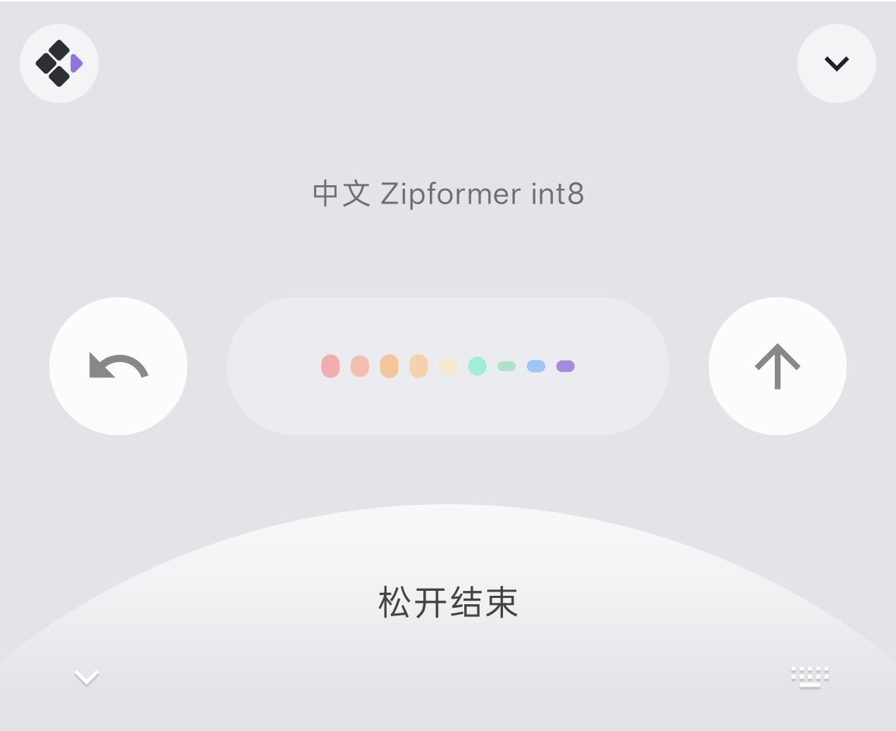<br><p align="center">语音输入</p></td>
    <td>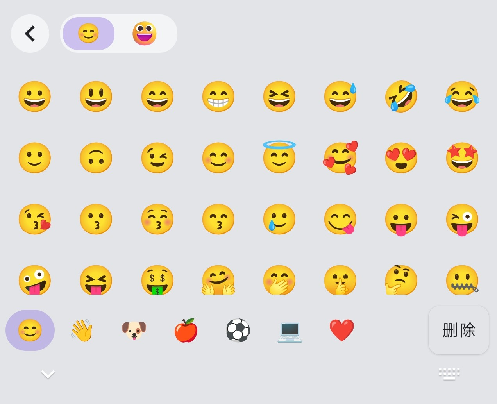<br><p align="center">Emoji 键盘</p></td>
  </tr>
  <tr>
    <td>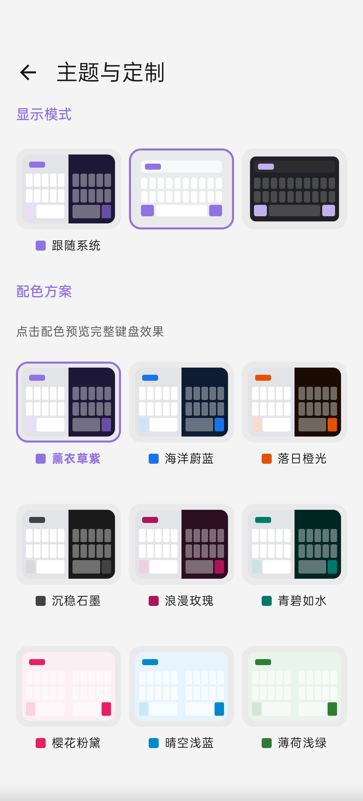<br><p align="center">主题设置（亮色）</p></td>
    <td>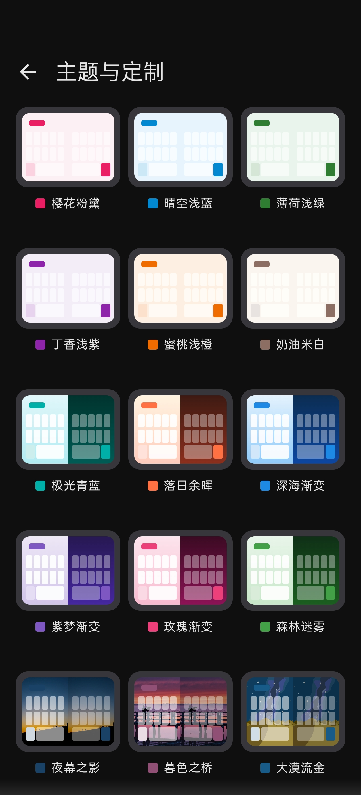<br><p align="center">主题设置（暗色）</p></td>
    <td><br><p align="center">插件管理</p></td>
    <td>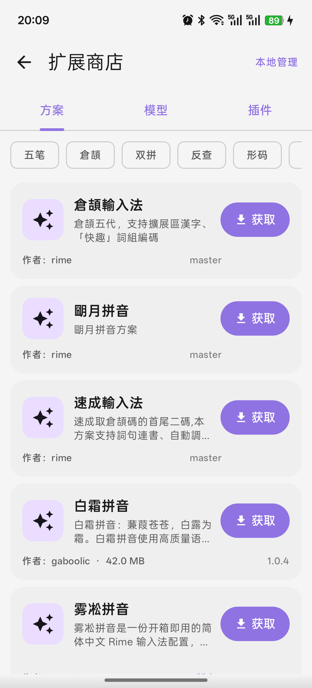<br><p align="center">扩展商店</p></td>
  </tr>
</table>

## 功能特点

- **多种输入方案** - 内置五笔86/98、拼音、混输方案，支持自定义（双拼、笔画等），可通过方案市场下载或无线导入
- **Rime 引擎** - 使用成熟稳定的 Rime 输入法引擎，精准可靠的中文输入体验
- **丰富键盘布局** - QWERTY 全键盘、T9 九宫格拼音、九宫格笔画、手写、数字（含计算器）
- **悬浮键盘** - 悬浮卡片样式，支持拖拽移动、半透明圆角设计
- **语音转文本** - 本地离线语音识别（内置流式 zipformer2 引擎），也支持在线 ASR 插件（FunAsr、Volc 等）
- **AI 智能增强** - 基于 Transformer 的联想词预测，输入更高效
- **简洁界面** - Material Design 3 风格，支持浅色/深色主题及多种配色方案
- **键盘调节** - 支持键盘高度调整和位置移动
- **工具栏定制** - 可自定义工具栏按钮布局和功能
- **按键反馈** - 可调节音效和振动强度
- **滑动手势** - 光标移动、删除、符号输入等滑动手势操作
- **剪贴板管理** - 剪贴板历史记录，支持快捷发送和置顶
- **剪贴板同步** - 通过插件与远端设备双向同步剪贴板（WebDAV、ximed 等）
- **候选词编码提示** - 候选词显示五笔编码，辅助学习
- **字根显示** - 下滑按钮显示五笔字根，方便健忘用户
- **实体键盘支持** - 连接物理/蓝牙键盘时显示浮动候选栏
- **WebDAV 同步** - 通过 WebDAV 备份和恢复方案与配置
- **插件市场** - 通过内置扩展商店安装可扩展 Lua 插件（表情、剪贴板同步、在线 ASR 等）

## 系统要求

- Android 9.0 (API 28) 及以上

## 安装

### 主程序下载

选择对应架构的 APK：
- **arm64-v8a**: 适用于大多数现代手机（**绝大部分人的手机都是这个**）
- **armeabi-v7a**: 适用于旧款32位手机
- **x86_64**: 适用于模拟器
- **universal**: 包含所有架构，体积较大

### 插件下载（可选）

插件为 Lua 脚本插件（.xipk 格式），可在主应用"设置 > 扩展商店"中安装和启用：
- **kaomoji**: 颜文字插件（提供精选颜文字）
- **meme-bunny**: 恶搞兔表情包插件（提供8个表情）
- **xime-fluent-emoji**: Fluent UI 3D 风格表情插件（222 个精选 3D 表情，9 大分类）
- **funasr-asr**: 阿里百炼 FunAsr 在线语音识别
- **volc-asr**: 火山引擎在线语音识别
- **webdav-clipboard-sync**: 基于 WebDAV 的剪贴板同步
- **ximed-clipboard-sync**: 基于 ximed 服务的剪贴板同步

更多插件请查看 [插件中心列表](https://ime.ximei.me/plugin-list.html)，或直接到手机应用的"设置 > 扩展商店"中浏览安装。

### 从 Release 下载

1. 在 [Releases](https://github.com/ximeiorg/Xime/releases) 页面下载最新版本的 APK
2. 安装应用
3. 在系统设置中启用 Xime 输入法
4. 将 Xime 设为当前输入法

### 国内下载

由于 APK 包是通过 GitHub Actions 自动构建的，国内的仓库没有免费的功能使用，因此如果你觉得 GitHub Release 下载不稳定，请自行构建安装，或者通过 [https://github.akams.cn](https://github.akams.cn) 来下载。

### 手动构建安装

1. 克隆项目并构建 APK
2. 安装应用
3. 在系统设置中启用 Xime 输入法
4. 将 Xime 设为当前输入法

## 使用文档

详细使用说明请查看 [使用文档](https://ime.ximei.me)。

- [常见问题 FAQ](https://ime.ximei.me/faq.html)
- [Rime 方案列表](https://ime.ximei.me/rime-list.html)
- [插件列表](https://ime.ximei.me/plugin-list.html)
- [AI 模型列表](https://ime.ximei.me/model-list.html)

## 构建

```bash
# 克隆项目（包含子模块）
git clone --recursive https://github.com/ximeiorg/Xime.git

# 或者在已克隆的项目中初始化子模块
git submodule update --init --recursive

# 构建 Release APK
./gradlew assembleRelease
```

## 技术栈

- Kotlin
- Jetpack Compose
- Material Design 3
- Rime (librime)
- JNI (Native C++)

## 贡献

欢迎贡献！在提交 PR 之前，请先阅读 [CONTRIBUTING.md](CONTRIBUTING.md) 了解贡献流程。

核心规则：
- **先提 Issue** — 所有改动必须先创建 Issue 讨论
- **最小修改** — PR 只包含所需的最小改动
- **GPG 签名** — 所有 commit 必须 GPG 签名

## 致谢

- [Rime](https://rime.im/) - 中州韵输入法引擎
- [Trime](https://github.com/osfans/trime) - 同文输入法，配置参考
- [fcitx5-android](https://github.com/fcitx5-android/fcitx5-android) - 键盘布局参考
- [onnxruntime](https://github.com/microsoft/onnxruntime) - 联想词预测与语音识别的 ONNX 推理引擎

## 许可证

GPLv3 License

Copyright © 2026 Kingz Cheung

"Xime" 名称、Logo 及其他品牌资产**不在** GPLv3 开源授权范围内，详见 [TRADEMARKS.md](TRADEMARKS.md)。
